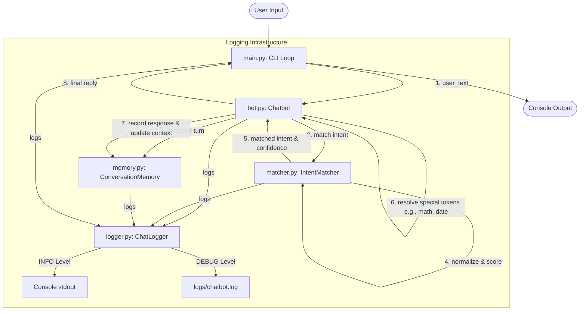

# Nexus: Modular Rule-Based AI Chatbot

[](https://www.python.org/)
[](https://opensource.org/licenses/MIT)
[]()
[](https://github.com/psf/black)

Welcome to **Nexus**, a highly modular, extensible, and robust rule-based AI chatbot implemented in pure Python. Designed and developed as part of an engineering internship at **DecodeLabs**, this project showcases clean software engineering practices, Object-Oriented Design (OOD) patterns, and comprehensive unit testing without relying on heavy third-party machine learning frameworks.

---

## 📖 Table of Contents
1. [Project Overview](#-project-overview)
2. [Architectural Flow](#-architectural-flow)
3. [Key Features](#-key-features)
4. [Project Structure](#-project-structure)
5. [Getting Started](#-getting-started)
   - [Prerequisites](#prerequisites)
   - [Running the Chatbot](#running-the-chatbot)
   - [Running the Test Suite](#running-the-test-suite)
6. [Design Decisions & Software Engineering Best Practices](#-design-decisions--software-engineering-best-practices)
7. [Future Enhancements](#-future-enhancements)

---

## 🌟 Project Overview

**Nexus** represents a production-ready approach to deterministic conversational systems. It uses structured intent registration, regex-based tokenizers, keyword scoring logic, dynamic token resolution, and context-dependent conversation states. 

### Why Rule-Based?
While modern LLMs are powerful, rule-based engines remain crucial in corporate environments for tasks requiring **100% predictability, low latency, zero hallucination risk, and local data compliance**. Nexus solves these needs by offering a maintainable codebase that can be easily customized with new intents, contexts, and business logic.

---

## 📐 Architectural Flow

The following diagram illustrates how user inputs are processed, intents are resolved, memory states are updated, and responses are formatted.



---

## ✨ Key Features

*   **Modular OOP Design**: Clean separation of concerns across intents, matching, memory, and logging.
*   **Context-Aware Intent Matching**: 
    *   **Phrase & Word Boundaries**: Eliminates false positives (e.g., matching the greeting intent `hi` inside words like `white` or `history` using `\b` boundaries).
    *   **Similarity Scoring**: Standardizes match confidence based on token hits and partial overlaps.
    *   **Context Gates**: Restricts certain intents to fire only when specific conversation states are active.
*   **Bounded Conversation Memory**: Implements a sliding-window queue (using python's `collections.deque`) to limit memory footprint while providing detailed session summaries (total turns, user messages, and most-used intents).
*   **Dynamic Response Resolvers**:
    *   `__TIME__` and `__DATE__`: Fetches localized system parameters.
    *   `__REPEAT__`: Returns the last bot response.
    *   `__MATH__`: Parsers standard arithmetic expressions (supports `+`, `-`, `*`, `/`, `^`, `plus`, `minus`, `times`, `divided by`, `to the power of`) using a **sandboxed evaluation engine** to prevent code execution vulnerability.
*   **Dual-Target Logging Framework**: Prints colorized, readable execution steps to the console (`INFO`) while storing highly detailed system flow to a rotating file handler at `logs/chatbot.log` (`DEBUG`).

---

## 📂 Project Structure

```text
DecodeLabs/
│
├── chatbot/
│   ├── __init__.py           # Package initializer, exports clean public API
│   ├── bot.py                # Main orchestrator (Chatbot class)
│   ├── intents.py            # Structured dataclasses and intent registry
│   ├── logger.py             # Dual-destination logging configurations
│   ├── main.py               # Interactive CLI client and styled banners
│   ├── matcher.py            # Text normalization and token scoring pipeline
│   ├── memory.py             # MemoryEntry records and sliding-window logic
│   └── test_chatbot.py       # Automated unit tests
│
├── logs/
│   └── chatbot.log           # Persisted debug execution logs (Generated automatically)
│
└── README.md                 # Project documentation
```

---

## 🚀 Getting Started

### Prerequisites
*   Python 3.8 or higher.
*   Standard Library only (no external pip packages required).

### Running the Chatbot

From the project root folder (`DecodeLabs/`), execute the chatbot CLI application using Python's module syntax:

```bash
python -m chatbot.main
```

#### Terminal Interface Commands
Inside the interactive CLI, you can type natural text or issue meta-commands:
*   `help`: Displays bot capabilities.
*   `history`: Shows the last 10 turns with precise timestamps and intent tags.
*   `summary`: Outputs a brief analytics summary of the current session.
*   `exit` / `bye`: Gracefully closes the session.

---

### Running the Test Suite

The project includes unit tests for intent matching, math parsing, conversation history limits, and edge conditions (e.g. division by zero). Run them using the following command from the root directory:

```bash
python -m unittest chatbot/test_chatbot.py
```

Expected output:
```text
Logger initialised - writing to ...\logs\chatbot.log
Chatbot 'TestNexus' initialised.
...
----------------------------------------------------------------------
Ran 9 tests in 0.007s

OK
```

---

## 🛠️ Design Decisions & Software Engineering Best Practices

### 1. Robust Security in Math Parsing
Instead of standard, dangerous `eval(user_input)` which opens the system to command execution exploits, the math resolver in `bot.py` uses strict sanitization:
*   Converts textual math indicators (like `plus`, `times`) into characters.
*   Cleanses the input string using regular expressions, restricting characters to a whitelist: `0123456789 +-*/().**`.
*   Blocks builtins entirely: `eval(raw, {"__builtins__": {}}, {"math": math})`.

### 2. Contextual Flow Management
By specifying a `requires_context` attribute on an `Intent`, the conversation can transition smoothly from a general state to a specialized sub-conversation (e.g., matching input within a specific workflow), preventing irrelevant intents from firing out of turn.

### 3. Graceful Crash Prevention
Stdout streams on Windows command terminals can crash when attempting to print emojis or non-ASCII characters. To avoid this, `main.py` and `logger.py` bootstrap stdout streams with `io.TextIOWrapper` using `UTF-8` encoding and standard replacements.

---

## 🔮 Future Enhancements

These items are designed as next-step milestones for production scaling:
1.  **API Integration**: Replace placeholder modules (like `weather`) with live REST API requests (e.g. OpenWeatherMap API).
2.  **Semantic Match Layer**: Integrate lightweight word embeddings (like TF-IDF or cosine similarity via scikit-learn) to enhance keyword matching with semantic understanding.
3.  **UI/UX Interface**: Wrap the chatbot in a lightweight web dashboard using a framework like Flask, FastAPI, or Streamlit.

---
*Developed by Kushagra Singh (DecodeLabs Intern).
